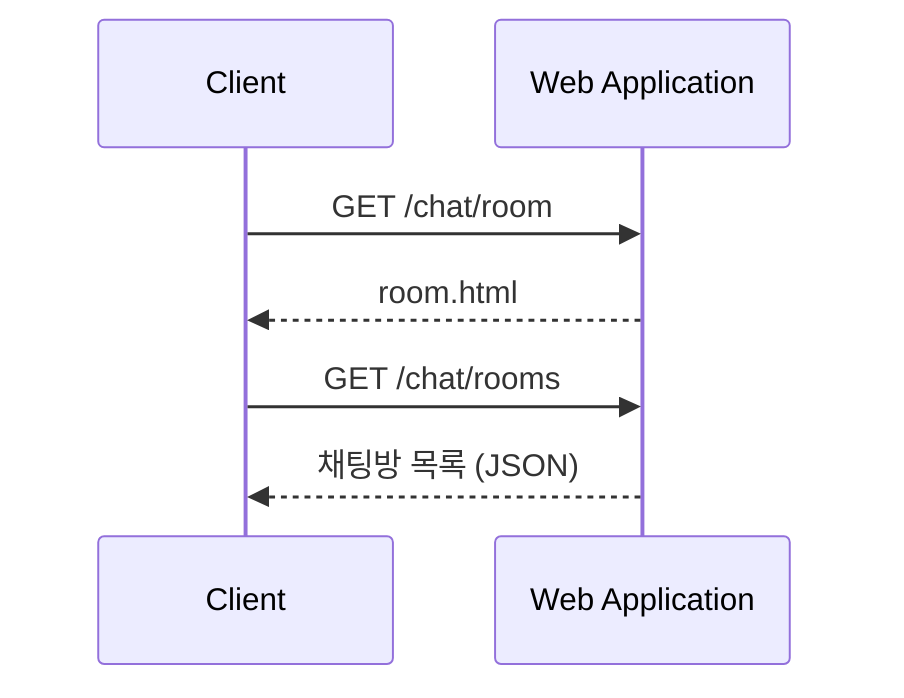
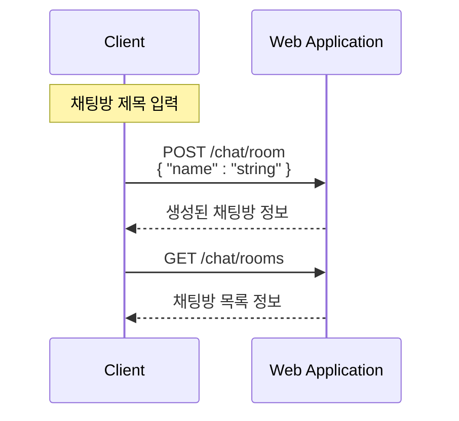
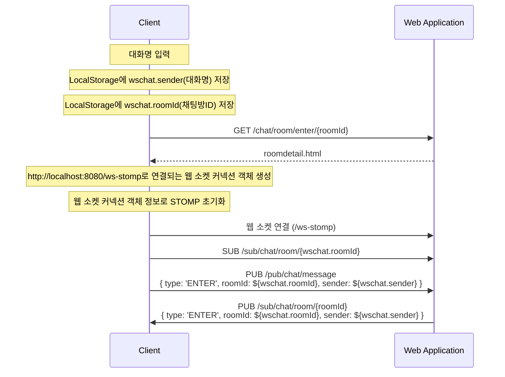
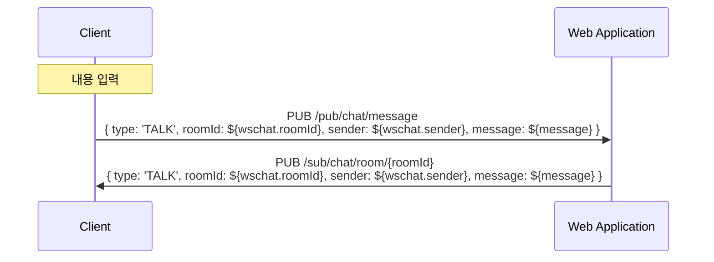

## 개요

본 글은 Spring과 Vue로 구현한 WebSocket 기반의 채팅 애플리케이션의 동작 로직을 분석하여 시퀀스 다이어그램으로 그린 것을 기록합니다.

*Project : https://github.com/LeeSM0518/spring-websocket-tutorial*

## 시퀀스 다이어그램

### 채팅방 목록 조회

### 채팅방 생성

### 채팅방 입장

### 채팅 전송

## Reference
https://github.com/codej99/websocket-chat-server